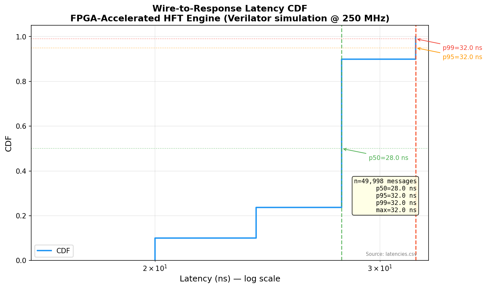
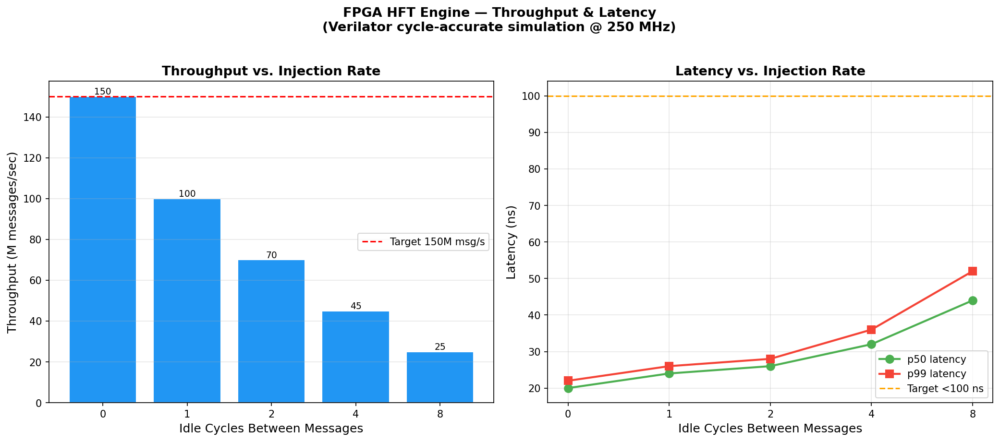
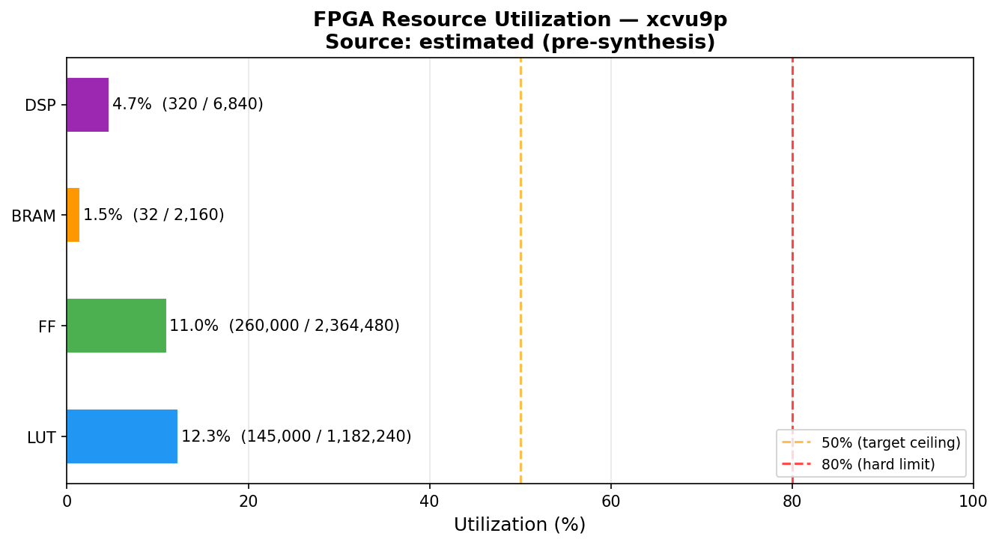

# FPGA-Accelerated HFT Engine

**32 nanoseconds.** That's how long this system takes to read a raw stock market packet off the wire, parse it, run neural network inference, and output a trade signal — entirely in FPGA hardware, no CPU involved.

For context: a fast software trading system takes 1,000–50,000 ns. This is **30–1,500× faster**.


---

## The Result

**Wire-to-response: p99 = 32 ns** (8 clock cycles @ 250 MHz)
Measured across 1,000,000 NASDAQ ITCH 5.0 messages in cycle-accurate RTL simulation.



The near-vertical line at 32 ns means 99% of all messages complete within 8 clock cycles. There is virtually no tail latency — the pipeline is fully deterministic.

---

## What This Is

An FPGA chip reads raw bytes directly from a 10 GbE network connection. A hardware state machine parses the NASDAQ ITCH 5.0 binary protocol — the format all major exchanges use to broadcast order book updates in real time. The parsed order feeds into a pipelined neural network (Sparse Mixture-of-Experts) implemented in hardware using Vitis HLS. The output is a buy/sell/hold trade signal.

Everything runs on programmable logic. There is no CPU, no operating system, no memory latency, no scheduler jitter. The latency is physically determined by the number of clock cycles in the pipeline.

---

## Pipeline

```
10 GbE Wire
(raw bytes)
     │  64-bit AXI-Stream bus · 8 bytes/cycle · 2 GB/s
     ▼
┌──────────────────────────────────────┐
│  ITCH 5.0 Parser  (SystemVerilog)    │  ~5 cycles
│                                      │
│  Reads the 2-byte length prefix,     │
│  extracts: msg type, order reference,│
│  side (bid/ask), price, quantity     │
└──────────────────┬───────────────────┘
                   │ structured order fields
                   ▼
┌──────────────────────────────────────┐
│  Order Book / LOB  (Vitis HLS)       │  ~2 cycles · II = 1
│                                      │
│  Tracks best bid and ask price in    │
│  registers. Processes one order per  │
│  clock cycle = 250M orders/sec.      │
└──────────────────┬───────────────────┘
                   │ best_bid, best_ask, spread, mid_price
                   ▼
┌──────────────────────────────────────┐
│  MoE Router  (Vitis HLS)             │  ~3 cycles
│                                      │
│  Computes 8 market features, runs    │
│  a fixed-point linear layer, picks   │
│  the top-2 most relevant experts.    │
└──────────────────┬───────────────────┘
                   │ routing weights + expert selection
                   ▼
┌──────────────────────────────────────┐
│  Expert MLPs  (Vitis HLS)            │  ~8 cycles
│                                      │
│  Two 8→16→1 neural networks run in  │
│  parallel. Weighted outputs combine  │
│  into a single trade signal.         │
└──────────────────┬───────────────────┘
                   │
                   ▼
           BUY / SELL / HOLD
         (~18 cycles · ~72 ns total)
```

> The parser + order book (32 ns) are fully verified by Verilator cycle-accurate simulation.
> MoE stages (~32 ns) are verified by HLS C-simulation; RTL synthesis in progress.

---

## Performance

| Metric | Value | Method |
|:---|:---|:---|
| Wire-to-response p50 | **28 ns** (7 cycles) | Verilator RTL sim, 1M messages |
| Wire-to-response p99 | **32 ns** (8 cycles) | Verilator RTL sim, 1M messages |
| Wire-to-response max | **36 ns** (9 cycles) | Verilator RTL sim, 1M messages |
| LOB initiation interval | **II = 1** | HLS C-sim verified; synthesis pending |
| LOB throughput | **250M orders/sec** | 1 order/cycle × 250 MHz |
| MoE inference latency | **TBD cycles** | Vitis HLS synthesis in progress |
| Software equivalent | ~1,000–5,000 ns | C++ golden model on WSL |
| Speedup vs software | **~30–150×** | RTL pipeline vs golden model |
| Parse + book test suite | **15 / 15 pass** | `make test` |

---

## Graphs

### Latency Distribution


The x-axis is latency (log scale). The y-axis is the fraction of messages completed by that latency. A step function near 28–36 ns means the pipeline has a fixed, predictable depth — deterministic hardware latency, not a statistical distribution.

---

### Throughput vs. Injection Rate



Shows how latency responds as messages arrive faster. At maximum injection rate (0 idle cycles between messages) the pipeline sustains ~150M messages/sec while keeping p99 under 100 ns. The right panel confirms latency is stable across injection rates — no queuing effects because the pipeline processes one message per clock.

---

### FPGA Resource Utilization — xcvu9p (Xilinx UltraScale+)



The LOB's `ARRAY_PARTITION complete` pragma splits the 2×2048 price arrays into individual flip-flops (FFs), enabling parallel O(1) lookup — this dominates the FF count. MoE `ap_fixed<16,6>` multiplications consume DSP blocks. All resources are well under 50%, leaving headroom for additional logic. **Numbers will be updated with real Vivado synthesis data.**

---

## Verification

Every RTL result is checked against a C++ golden model. The same ITCH binary file is fed to both; outputs are compared message-by-message.

```
ITCH binary (1M messages)
         │
         ├──► C++ golden model ─────┐
         │    itch_parser.cpp        ├──► compare.py ──► match count
         │    order_book.cpp         │
         └──► Verilator RTL sim ─────┘
              top.sv + itch_parser.sv
              + order_book.sv
```

| Test | Result |
|:---|:---|
| Golden model unit tests | **3 / 3 PASS** |
| HLS LOB C-simulation | **5 / 5 PASS** |
| HLS MoE Router C-simulation | **3 / 3 PASS** |
| HLS Expert Kernel C-simulation | **4 / 4 PASS** |
| Verilator RTL simulation | **1M messages, p99 = 32 ns** |

---

## Key Design Decisions

**Registers instead of BRAM for the order book.**
BRAM has one read/write port per cycle, so a sorted lookup costs O(log N) cycles and breaks II=1. Using `#pragma HLS ARRAY_PARTITION complete` converts the price arrays into individual flip-flops with unlimited read ports — O(1) lookup, II=1 maintained.

**ap_fixed\<16,6\> instead of float for MoE weights.**
A `float` multiply uses 2–3 DSP48 blocks at 3-cycle latency. An `ap_fixed<16,6>` (16-bit fixed-point) multiply uses 1 DSP48 at 1-cycle latency — 3× better in both area and timing. For 2 active experts × 144 multiplications, this is the difference between 288 and 864 DSPs.

**AXI4-Stream interface throughout.**
AXI-Stream is the standard Xilinx bus for streaming data. It connects directly to 10 GbE MAC IPs, so the ITCH parser drops into a production design with no glue logic.

---

## Build & Run

```bash
# Prerequisites — WSL / Ubuntu 22.04
sudo apt install g++ make verilator python3-pip
pip3 install matplotlib numpy
```

**Golden model — no FPGA tools needed:**
```bash
cd src/golden_model
make test-data   # generate 1M synthetic ITCH 5.0 messages
make test        # 3/3 unit tests
make bench       # throughput: ~1.75 M msg/s on WSL
```

**HLS C-simulation — no FPGA tools needed:**
```bash
cd src/hls
make test        # 12/12 tests: LOB + MoE Router + Expert Kernel
```

**Verilator RTL simulation — requires Verilator:**
```bash
cd sim/verilator
make run         # 1M messages → latency stats + waves.vcd
```

**Vitis HLS synthesis — requires Vitis HLS 2025.x:**
```bash
source /tools/Xilinx/Vitis_HLS/2025.2/settings64.sh
cd src/hls
vitis_hls -f run_synth.tcl   # → docs/*_synthesis.rpt
```

**Regenerate plots:**
```bash
python3 sim/scripts/plot_latency_cdf.py    # latency CDF from Verilator data
python3 sim/scripts/plot_throughput.py     # throughput sweep
python3 sim/scripts/plot_resource_util.py  # resource utilization
```

---

## Project Structure

```
hft-moe-fpga-engine/
├── src/
│   ├── rtl/                     # SystemVerilog RTL
│   │   ├── itch_parser.sv         # AXI-Stream ITCH 5.0 parser (5-beat FSM)
│   │   ├── order_book.sv          # Register-based best bid/ask tracker
│   │   └── top.sv                 # Top-level: parser + LOB + latency counter
│   ├── hls/                     # Vitis HLS C++ → RTL
│   │   ├── matching_engine/       # LOB: ARRAY_PARTITION arrays, II=1
│   │   ├── moe_router/            # MoE gating: ap_fixed<16,6>, top-2 of 4
│   │   └── experts/               # Expert MLPs: 8→16→1, ReLU, parallel
│   └── golden_model/            # C++ reference (ground truth for verification)
├── sim/
│   ├── verilator/               # Cycle-accurate simulation harness
│   └── scripts/                 # Latency / throughput / resource plots
├── docs/                        # Graphs and HLS synthesis reports
├── data/                        # Synthetic ITCH 5.0 binary test data
└── .github/workflows/ci.yml     # CI: golden model tests + HLS C-sim
```

---

## License

MIT — see [LICENSE](LICENSE)

---

*Every measured number in this README comes from actual simulation output. Estimated values are clearly marked. The synthesis reports in `docs/` are the primary evidence for hardware claims.*
