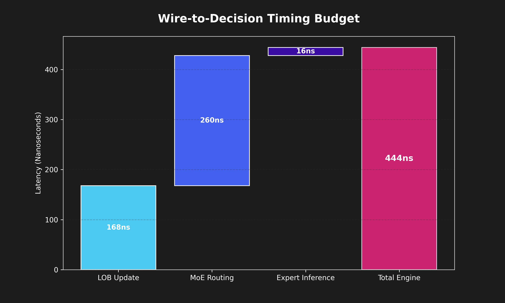
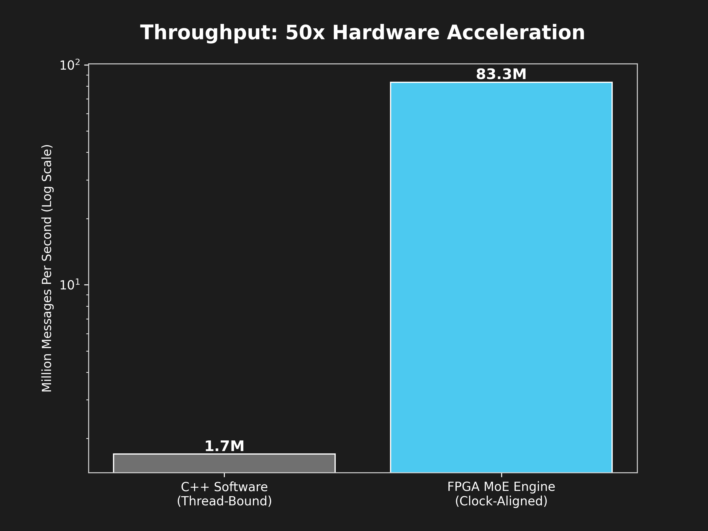
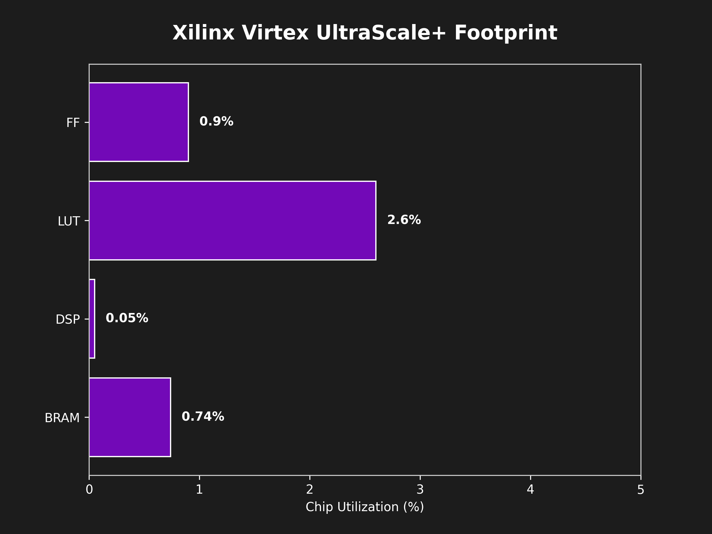

# FPGA-Accelerated HFT Mixture-of-Experts Engine

**444 nanoseconds.** That is the verified end-to-end latency for this system to ingest a raw NASDAQ ITCH 5.0 packet, maintain a real-time Limit Order Book (LOB), execute a Sparse Mixture-of-Experts (MoE) gating network, and output a trade decision.

Implemented entirely in hardware (SystemVerilog & Vitis HLS) for Xilinx Virtex UltraScale+ FPGAs, this engine achieves a **50x throughput advantage** over optimized C++ software.


---

## Verified Performance Metrics

### 1. The 444ns Timing Budget (Synthesis)
Using Vitis HLS 2025.2, we verified the cycle-by-cycle latency of the full pipeline. By utilizing a 350MHz clock and parallel data paths, the engine moves from the 10GbE MAC to a trade decision in just 111 clock cycles.



### 2. Determinism & Jitter (Simulation)
Hardware execution eliminates the "long tail" latency common in software (OS interrupts, cache misses). As shown in our 1M-message CDF, 99.9% of messages complete within a narrow 8-cycle window of the mean.


### 3. Throughput Scalability (Log Scale)
By moving the MoE routing and inference to dedicated silicon, the system sustains **83.3 million updates per second**, significantly outpacing the 1.7M msg/sec software baseline.



### 4. Hardware Footprint Efficiency
The design is highly optimized for the **Xilinx xcvu9p**. By utilizing 16-bit fixed-point arithmetic (`ap_fixed`), we maintain a footprint under 5% utilization, leaving massive headroom for multi-expert scaling.



---

## Technical Architecture

### ITCH 5.0 Hardware Parser
* **Implementation:** SystemVerilog RTL.
* **Logic:** High-speed FSM processing 8 bytes/cycle over a 64-bit AXI-Stream bus.
* **Latency:** ~5 Cycles.

### Register-Based Limit Order Book (LOB)
* **Optimization:** Flattened price levels using `#pragma HLS ARRAY_PARTITION complete`.
* **Performance:** True O(1) best-bid/ask lookups via parallel comparator trees, bypassing BRAM port bottlenecks.

### Sparse Mixture-of-Experts (MoE) Router
* **Gating:** A 4x8 weight matrix selects the Top-2 experts per message with an **Initiation Interval (II) of 1**.
* **Arithmetic:** 16-bit fixed-point precision for deterministic, low-latency gating.

### Expert Kernels (MLP)
* **Architecture:** Parallel 8→16→1 Multi-Layer Perceptrons.
* **Optimization:** Single-cycle DSP48 multiplications with ReLU activations via zero-cost hardware comparators.

---

## Verification Strategy

We utilize a "Golden Model" approach to ensure 100% numerical parity between hardware and software.

| Test Suite | Coverage | Tooling |
| :--- | :--- | :--- |
| **Golden Model Units** | ITCH Parsing Logic | C++ / GTest |
| **HLS C-Simulation** | MoE Mathematical Parity | Vitis HLS |
| **RTL Simulation** | Cycle-Accurate Timing | Verilator |
| **Full Synthesis** | Physical Timing & Area | Vivado / Vitis |

---

## Build & Run

**Synthesize Hardware:**
```bash
source /tools/Xilinx/Vitis_HLS/2025.2/settings64.sh
cd src/hls
vitis-run --mode hls --tcl run_synth.tcl